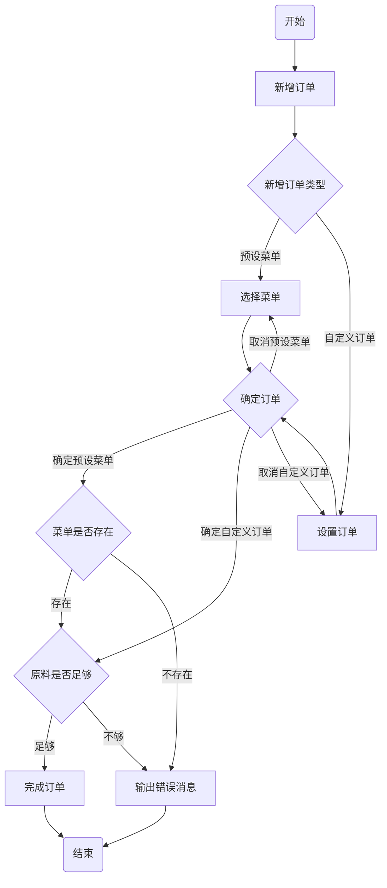

# Coffee-Machine
高级程序语言设计课程设计项目——咖啡机模拟程序
要编译的是src/CoffeeMachine.cpp

```mermaid
graph TB
    Start(开始) --> Open[新增订单]
    Open --> NewOrder{"新增订单类型"}
    
    NewOrder -->|预设菜单| Select[选择菜单]
    Select --> Sure{"确定订单"}
    Sure -->|确定预设菜单| HasMenu{"菜单是否存在"}
    Sure -->|取消预设菜单| Select[选择菜单]
    HasMenu -->|存在| HasIng{"原料是否足够"}
    HasMenu -->|不存在| Error[输出错误消息]
    
    NewOrder -->|自定义订单| Setting[设置订单]
    Setting --> Sure{"确定订单"}
    Sure -->|确定自定义订单| HasIng
    Sure -->|取消自定义订单| Setting
    HasIng -->|足够| Complete[完成订单]
    HasIng -->|不够| Error[输出错误消息]
    Complete --> End(结束)
    Error --> End(结束)
```
